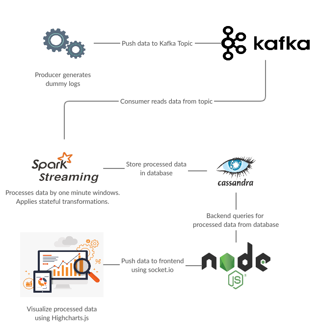
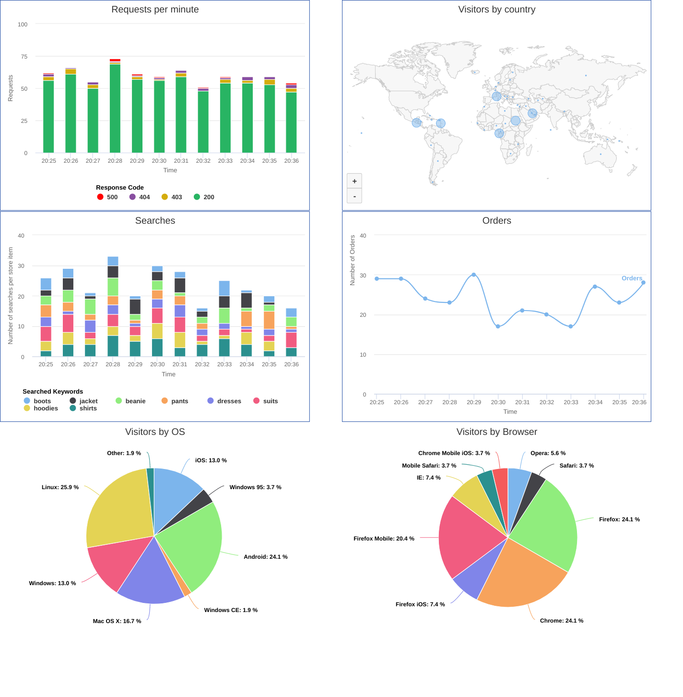

# Real-time Dashboard
## Architecture
The real-time dashboard is implemented using:
* Apache Kafka
* Apache Spark Streaming
* Producer and Consumer written in Scala and Python
* Backend: Node.js, Cassandra, socket.io
* Frontend: HTML, Highchart.js



## Usage

Start Zookeeper

```bash
zookeeper-server-start.sh $KAFKA_HOME/config/zookeeper.properties
```

Start kafka

```bash
kafka-server-start.sh $KAFKA_HOME/config/server.properties
```

Start cassandra

```bash
cassandra -f
```

Create topic

```bash
kafka-topics.sh --create --zookeeper localhost:2181 --replication-factor 1 --partitions 1 --topic access-log
```

Start the producer and pass the topic name as an argument

```bash
python producer.py --topic access-log
```

Start the consumer to read and process the messages
Navigate to src/consumer and run
```bash
sbt run
```

Run the backend server via

```bash
node index.js
```

And view the dashboard [here](http://localhost:8080/)

## Screenshot
